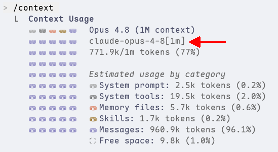
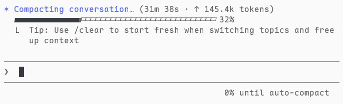

# 第 3 章 Claude Code 常用的斜線命令

## /context 命令補充說明（以 Claude Code 2.1.161 為準）

sonnet 4.6 模型的**上下文視窗（context window）** 已經高達 1m 個 tokens，不過目前 `/context` 命令的輸出結果中，仍然會以 200k 為上下文視窗，在我們的測試中，就會發生 context 用量已經超過 100% 的情況，例如底下這個極致的狀況：

居然可以使用到 386%。如果切換成 opus 模型，就會看到上下文視窗是正確的 1m：

你可以注意到 opus 模型的實際識別名稱是 claude-opus-4-8\[1m\]，結尾的 "[1m]" 會讓 Claude Code 自動以 1m 為上下文視窗，否則就會以 200k 為準。

此外，雖然文件上都說 Claude Code 會依據用量到達上下文視窗的一定比例（預設是 **95%**）觸發自動壓縮（稱為 **Proactive Compact**），但目前似乎 Claude Code 在進行大規模的測試，為某些帳號取消 Proactive Compact，稱為 **Reactive Compact**，這些帳號不會因為用量到達上下文視窗的一定比例就觸發自動壓縮，而是會等到叫用 API 因為超過上下文視窗出錯才觸發自動壓縮。以下就是使用 sonnet 模型到達 1m 界線才觸發自動壓縮的例子：

我們至少有 4 個測試帳號（1 個 team 帳號, 3 個 pro 帳號）都是採用 Reactive Compact，才會如上所示達到 100% 以上的用量都還不會觸發自動壓縮，而且還可以繼續正常對話，因為對 sonnet 4.6 來說，真正的上下文視窗並不是 200k, 而是 1m。

> 也許是因為未來模型的上下文視窗都會更大，在到達上下文視窗限制前理論上都應該要使用 `/compact` 手動壓縮才會符合經濟效益，所以測試採用 Reactive Compact 的效果吧！

### 用量的計算

Claude Code 會在輸入區的右下角顯示目前的 token 用量，像是這樣：

如果你和 `/context` 的結果比對，會發現這個數字會比較大，像是剛剛看到的是 28289 個 tokens，但是 `/context` 中的卻是 27.8k：

這是因為 `/context` 顯示的是最後一次交談時送給模型的內容，並沒有包含該次交談的回覆。但輸入區右下角顯示的是這次交談時會送給模型的內容，因此就會包含最後一次交談的回覆，總數一定比 `/context` 看到的大。

### 壓縮的安全界線

Claude Code 在進行壓縮時，預設產生最多 **20k（或模型的最大輸出量，看誰小）** 個 token 的摘要內容。為了讓壓縮順利完成，可以送給模型的最大內容就是 `(上下文視窗大小 - 20k)` 個 token，這稱為 **實際上下文視窗（Effective context window）**。以 Claude Code 對於 sonnet 4.6 誤認的 上下文視窗 200k 來說，實際上下文視窗就是 `200k - 20k = 180k`。 

> 如果你覺得奇怪，上下文視窗不是單純指送給模型的 token 數量限制嗎？為什麼要留空間給輸出？這是因為 LLM 本質是 token 接龍，所以在生成的過程中，必須把輸入以及剛剛新生成的 token 串接後再送回給模型，才能再生成下一個 token。也就是說，如果要生成 20k 個 token，生成最後一個 token 時就要送回原始的輸入內容，以及剛剛生成的 `20k - 1` 個 token，如果沒有限制輸入內容，就可能會超過上下文視窗限制，發生無法完整生成的問題。

如果是 Proactive compact 的用戶，還會更嚴苛，由於自動壓縮是在交談前檢查，所以有可能會發生交談前未超過實際上下文視窗，但加上交談後的回覆卻超過實際上下文視窗太多，導致下次交談時觸發自動壓縮但卻無法順利完成的問題。因此，Proactive compact 會再保留 13k 的空間當緩衝，以 `(實際上下文視窗- 13k)` 當界線，稱為 **自動壓縮觸發點（Auto Compact Threshold）**。同樣以 sonnet 4.6 為例，就是 `180k - 13k = 167k`。實際觸發自動壓縮的百分比就是以此為基準。

> 你可能會想到，Reactive Compact 是以叫用 API 時上下文視窗爆掉才觸發自動壓縮，既然上下文視窗已經爆掉了，為什麼還可以叫用 API 進行摘要？這是因為壓縮時進行摘要使用的系統指示內容和一般交談不同，內容只有很簡單要求摘要的說明，不含內建工具等等一般交談會傳送的內容，只要觀察前面 `/context` 的輸出內容，就可以知道光這樣就少了 20k 以上，足夠生成 20k 的摘要內容。

### 用量警告

當你的用量超過剛剛提到的 `(自動壓縮觸發點 - 20k)` 時，Claude Code 就會開始在輸入區右下角顯示警告訊息。以 200k 的上下文視窗為例，用量超過 `167k -20k = 147k` 時，就會在輸入區右下角顯示用量的下方看到百分比警告訊息，像是底下的例子就是 "99% context used"：

如果和 `/context` 的輸出結果比對，又會發現兩個用量比例不一樣：

輸入區說 99%，但是 `/context` 看到的卻是 87%，這是因為兩者的計算方式不一樣：

- `/context`：`(最後一次交談送給模型內容的用量) ÷ (上下文視窗)`，以本例來說，就是 `173.7 ÷ 200 = 0.8685`，所以是 87%。這個比例要表達的是最近一次交談前的狀況，因此是最後一次交談時送給模型的內容佔整個上下文視窗的比例，會隨著持續使用一直變大。
- 本例 Reactive Compact 用戶的輸入區的警告訊息：`(輸入區看到的用量 ÷ 實際上下文視窗)`，以本例來說，就是 `178.257k ÷ (180k) = 0.9903`，所以是 99%。表達的是離安全界線有多近，最大就是 100%，表示已經達到界線。

- Reactive Compact 用戶的輸入區的警告訊息：和 Proactive Compact 用戶的計算類似，但是分母改成自動壓縮觸發點，並且以和安全界線的距離呈現，也就是 `1 - (輸入區看到的用量 ÷ 自動壓縮觸發點)`，而訊息的格式會改成 "xx% until auto-compact"，像是這樣：

    

    代表的是還差多少百分比就會觸發自動壓縮，本例就是已經到達自動壓縮觸發點，因此是 0%，上方也可以看到正在壓縮。

